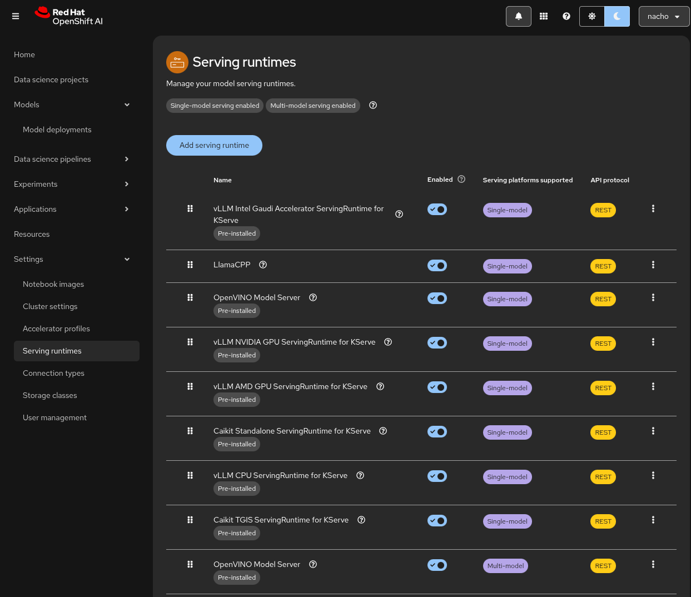
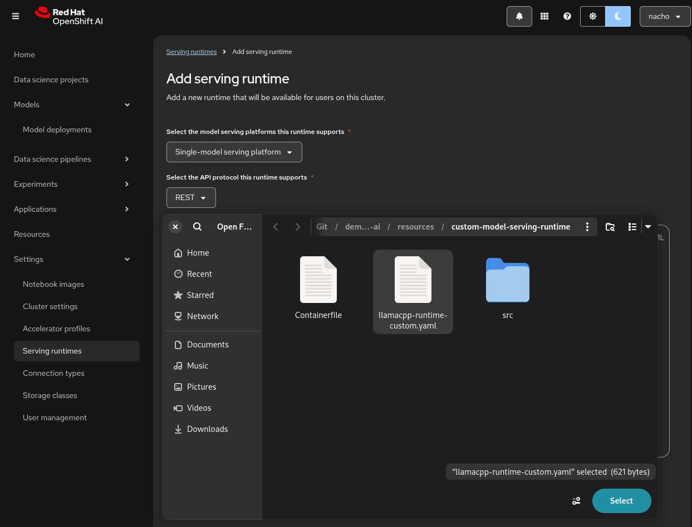
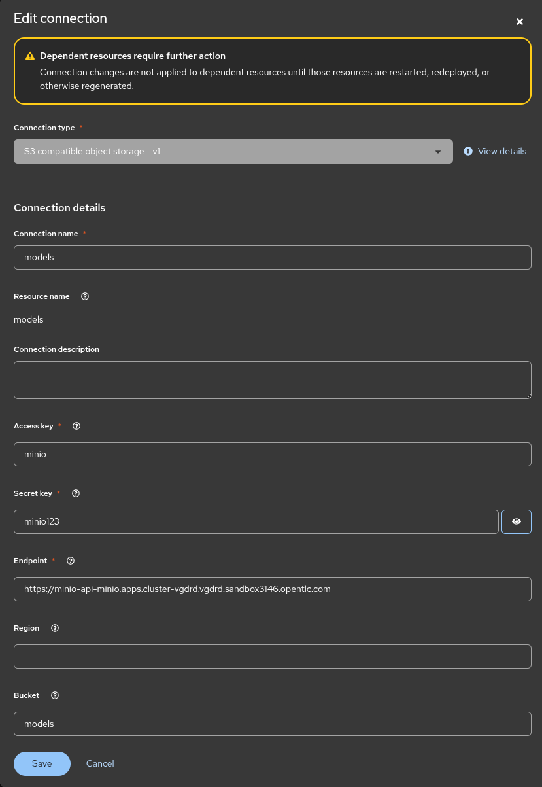
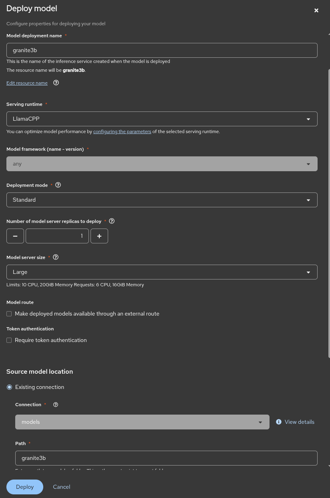
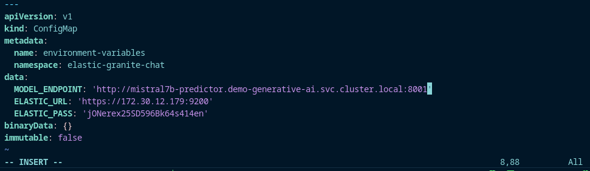
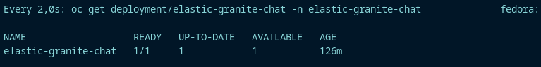

# Step 1 - Pre Requisites

First Install ArgoCD using the following command:
    
    oc apply -k bootstrap/argocd 

>    namespace/openshift-gitops created
    clusterrolebinding.rbac.authorization.k8s.io/argocd-rbac-ca created
    subscription.operators.coreos.com/openshift-gitops-operator created

Install all the needed operators:
    
    oc apply -f bootstrap/00_pre-requisites.yaml

>    appproject.argoproj.io/pre-requisites created
    application.argoproj.io/pre-requisites created

Install Openshift AI:

    oc apply -f bootstrap/01_rhoai.yaml
    
>   appproject.argoproj.io/rhoai created
    application.argoproj.io/rhoai created

Now we deploy Minio for our S3 Storage:

    oc apply -f bootstrap/02_minio.yaml

>   application.argoproj.io/minio created

And finally we deploy the Elasticsearch for our vector database:

    oc apply -f bootstrap/04_elasticsearch.yaml

>   application.argoproj.io/elasticsearch created

# Step 2 - Add the Certificates

Get the name of the ingress cert:

    oc get secrets -n openshift-ingress | grep cert

Extract from the secret:

    oc extract secret/<CERT_SECRET_FROM_ABOVE> -n openshift-ingress --to=aux/ingress-certs --confirm

Finally update the certs:

    cd aux/ingress-certs 

    oc create secret generic knative-serving-cert -n istio-system --from-file=. --dry-run=client -o yaml | oc apply -f -

    cd ../..

# Step 3 - Download and add the models to MINIO

Download the models for Granite and Mistral, for IBM Granite go here:

    https://huggingface.co/ibm-research/granite-3.2-8b-instruct-GGUF

For Mistral go here:

    https://huggingface.co/TheBloke/Mistral-7B-OpenOrca-GGUF

We can also download them from the Podman AI, for that we have to first install podman destktop:

        https://podman-desktop.io/

Then we add the AI Lab Plugin:

    https://podman-desktop.io/docs/ai-lab

Then we have to go to the AI Lab Plugin => Catalog and then we decide which one we want to download:

We create the paths for granite3b and mistral7b:

Once we have the images on our local machine we can upload them to Minio, for this we need to get to the bucket we made earlier (models) and the pick the folder for the model we want to upload and click upload find it in our local machine and upload it:

# Step 4 - Deploy the model Serving

First we update the Data Science Cluster (DSC):

    oc apply -k resources/model-server/components-serving

>    dscinitialization.dscinitialization.opendatahub.io/default-dsci configured

Deploy custom-model-serving-runtime for this we need to create the data science project "demo-generative-ai" we do it from the graphical interface:

>    Data science project => Create Project => Name = demo-generative-ai => Create

We have to deploy the serving runtime from the UI:

*   Settings => Serving runtimes => Add serving runtime 

*   Select the model serving platforms this runtime supports
> Single-model serving platform
*   Select the API protocol this runtime supports
>  Rest

*   Upload the yaml file from: ./resources/custom-model-serving-runtime/llamacpp-runtime-custom.yaml

First we need to create the connection to the minio to retrieve the models:

    Select Connections => Create connection => S3 Compatible
    Name = models
    Access key = minio
    Secret key = minio123
    Endpoint = Your Minio API URL
    Bucket = models

Now deploy the Mistral Model, start by filling the data: 

>   Model name = mistral7b
    Serving runtime = mistral7b
    Model framework = any
    Deployment Mode = Standard
    Model server size = Large
    Path = mistral7b

And finally we deploy the Granite Model, start by filling the data:

>   Model name = granite3b
    Serving runtime = granite3b    
    Model framework = any    
    Deployment Mode = Standard    
    Model server size = Large     
    Path = granite3b

We'll now create a workbench where we can upload a Jupyter notebook to ingest data into the Elasticsearch vector database, we are going to do this in our Project (demo-generative-ai)

    Select Create a workbench

Use the following values:

    elastic-vectordb-workbench
    Standard Data Science 
    Medium size

Add the following Enviroment Varibales using ConfigMap:

    CONNECTION_STRING: <Cluster-IP>:9200

You can get the values executing the following command:

    oc get service elasticsearch-sample-es-http -n elastic-vectordb

The other Enviroment Varibales is:

    PASSWORD: <Elasticsearch Password>

You can get the values executing the following command:

    oc get secret elasticsearch-sample-es-elastic-user -n elastic-vectordb -o jsonpath="{.data['elastic']}" | base64 -d > elastic_pass.txt

Note: You can delete the elastic_pass.txt file that you got the password from after you add it to the environment variable.

Now we need to log in to our workbench using the BUTTON on the Openshift-AI UI.

# Step 5 - Deploy Chatbot and connect it to the Elastic Vector DB and the Models

First we need to retrieve the values and populate the corresponding configMaps

For the Granite:

    vim ./resources/chatbot/granite/configmap.yaml

For the Mistral:

    vim ./resources/chatbot/granite/configmap.yaml

Then we need to deploy the apps using GitOps for that we, for mistral:

    oc apply -k 

>   appproject.argoproj.io/elastic-granite-chat created
    application.argoproj.io/elastic-granite-chat created

For Granite:

    oc apply -f bootstrap/06_mistral-chat.yaml 
>   appproject.argoproj.io/elastic-mistral-chat created
    application.argoproj.io/elastic-mistral-chat created

We wait till the chatbot is deployed, it can take a few minutes to be ready.

For Granite: 

    watch oc get deployment/elastic-granite-chat -n elastic-granite-chat 

For Mistral:

    watch oc get deployment/elastic-mistral-chat -n elastic-mistral-chat

Once the deployments are ready we get the route and we can access the chatbots UI.

For Granite:

    oc get route -n elastic-granite-chat

For Mistral:

    oc get route -n elastic-mistral-chat

And... CONGRATULATIONS we are finally DONE!