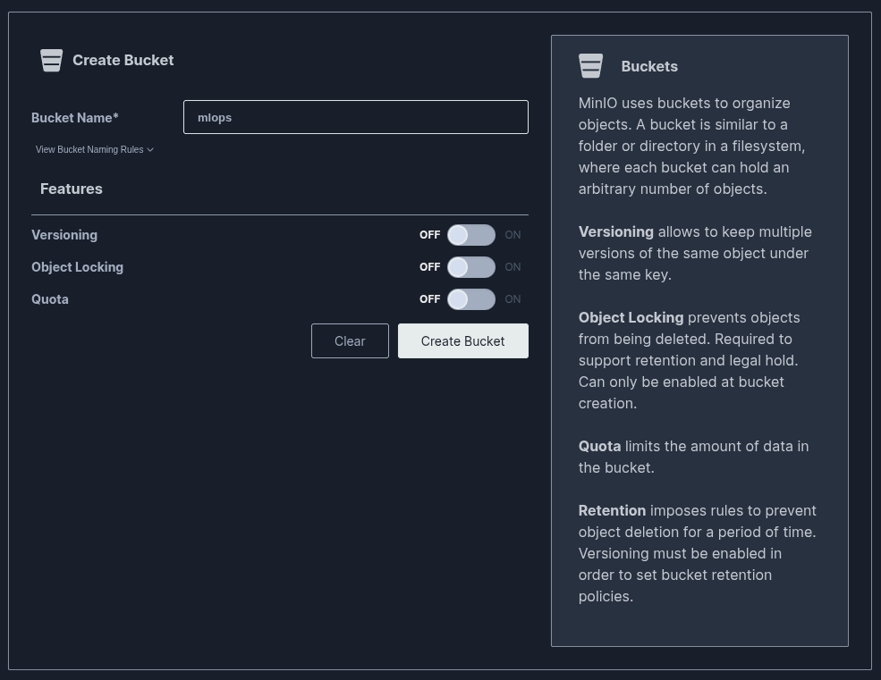

First we create the bucket for our pipelines, for this we go to the Minio UI:

    oc get route -n minio

>   NAME        HOST/PORT                                                          PATH   SERVICES        PORT   TERMINATION     WILDCARD
minio-api   minio-api-minio.apps.cluster-vgdrd.vgdrd.sandbox3146.opentlc.com          minio-service   api    edge/Redirect   None
minio-ui    minio-ui-minio.apps.cluster-vgdrd.vgdrd.sandbox3146.opentlc.com           minio-service   ui     edge/Redirect   None

Now we have to go to the Openshift AI UI and access Data science pipelines => Pipelines => Configure pipeline server, there we add the following values:

    Access key: minio
    Secret key: minio123
    Endpoint: <minio-api-endpoint>
    Region: eu-west-1
    Bucket: mlops  
